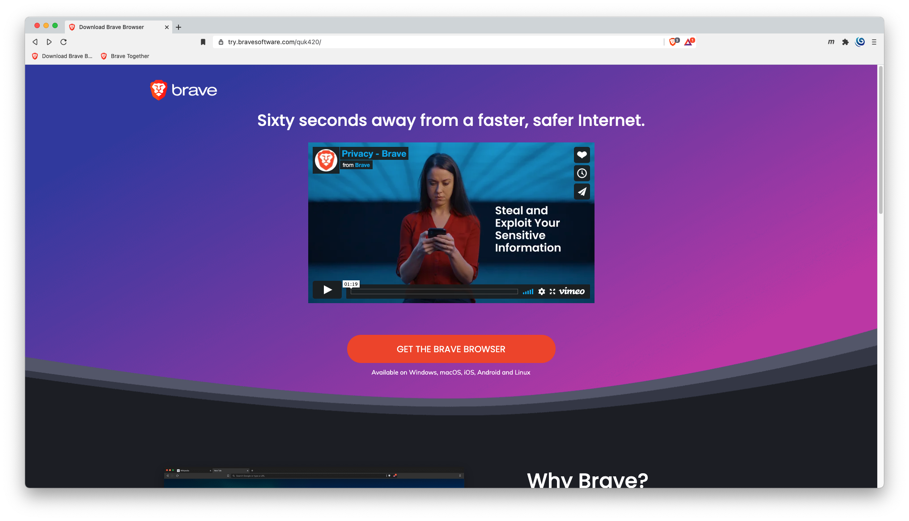
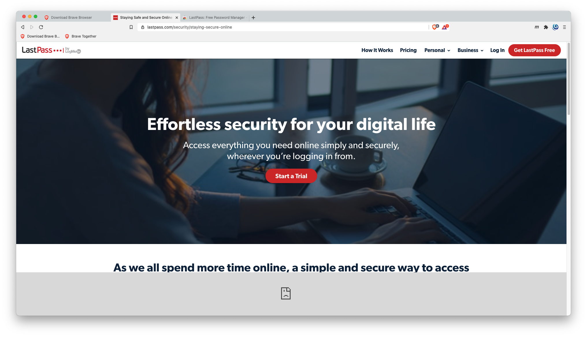
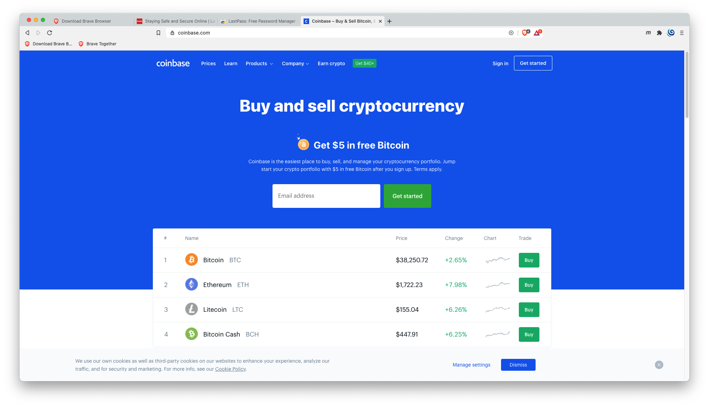
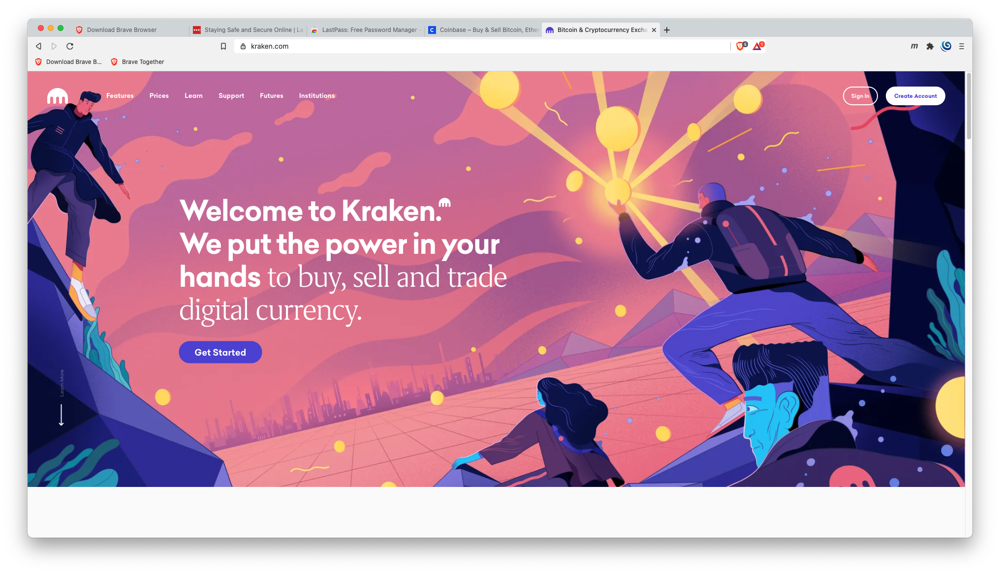
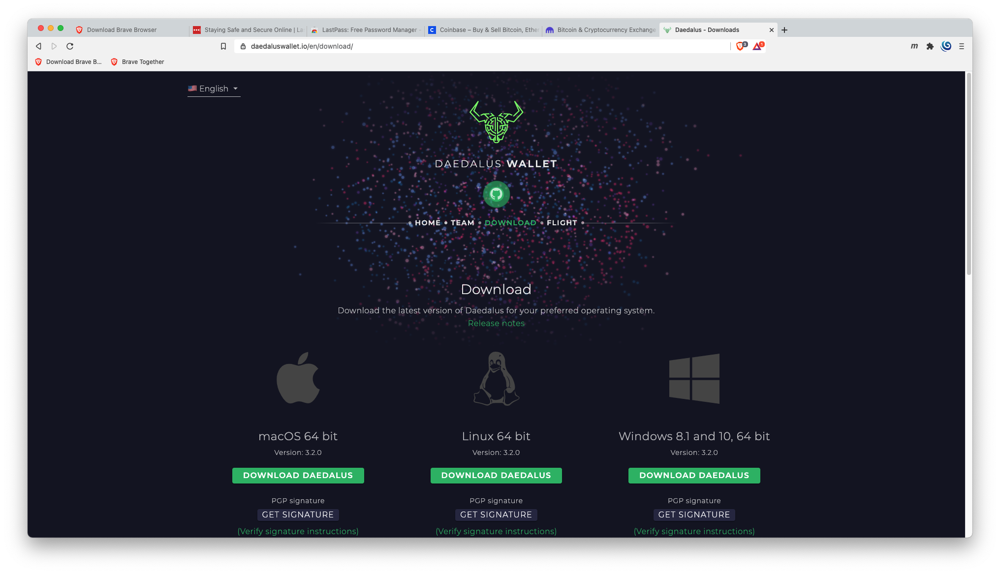
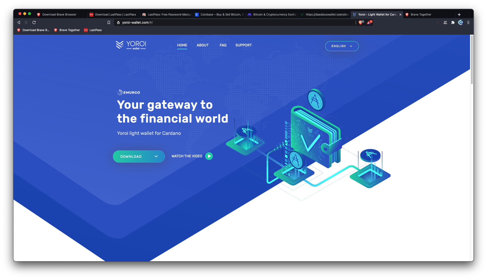
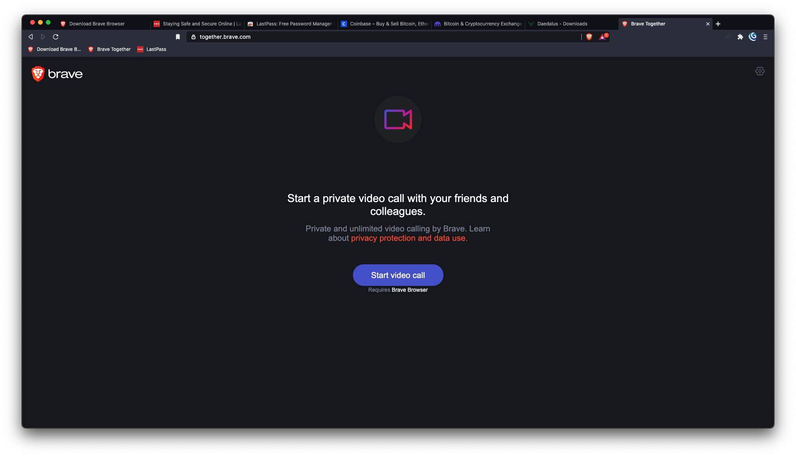
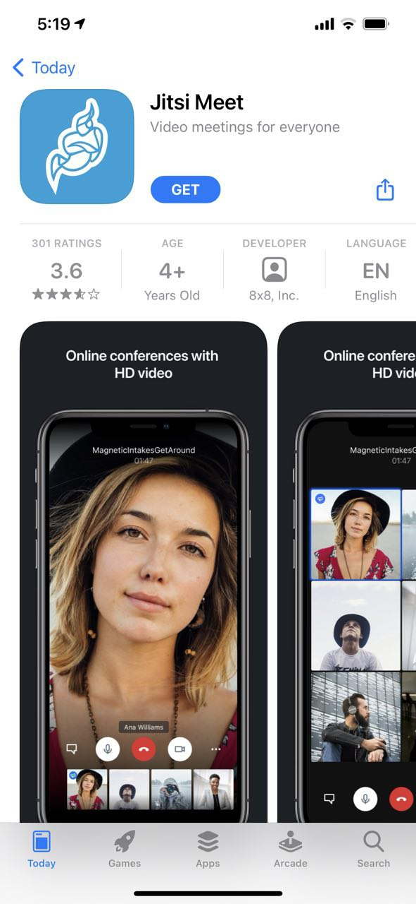

# Crypto Noobie
**Thur-11:00AM 02-11-2021**

## TLDR

If you are interested in participating in the digital asset, crypto, blockchain world but don't quite know where to begin, this is the place to start.

---
> THIS IS AN IN PROGRESS DOCUMENT!! NOT ALL STEPS ARE COMPLETE.
---

# Learn More About Crypto

[Kraken] has created a great resource if you would like to explore crypto
currencies and blockchain in greater detail.
[kraken.com/learn](https://www.kraken.com/learn)
## Getting Started
### Objective
To use and support public blockchains to invest and earn cryptographic currencies.  Here are the general steps we are going to be taking.
1. Download & install the [Brave] browser.
2. Create a [LastPass] account.
  1. Download & install:
    1. [LastPass] for your computer.
    2. [LastPass] App on your mobile phone.
    3. [LastPass] Browser extension for the Brave browser.
    4. [LastPass Authenticator].
4. Create an account at [Coinbase].
    1. Setup two factor authentication, account security using [LastPass Authenticator].
    2. Verify your identity with a state issued drivers license.
    3. Attach your bank account for ACH bank withdrawals.
5. Create an account at [Kraken].
    1. Setup two factor authentication, account security using [LastPass Authenticator].
    2. Verify your identity with a state issued drivers license.
6. Download & install Cardano's [Daedalus] wallet or [Yoroi] wallet for phones. 
7. Purchase Bitcoin (BTC) or Ethereum (ETH) on [Coinbase].
8. Send some of your Bitcoin/Ethereum to Kraken.
    1. On [Kraken] BTC is listed as [XBT].
9. Convert Bitcoin/Ethereum to Cardano (ADA).
10. Send your Cardano (ADA) to your [Daedalus] or [Yoroi] wallet.
11. Delegate your stake in your [Daedalus] or [Yoroi] wallet to the TETON Stake
    Pool.

### What it is used for:
- [Brave] Browser - Secure blockchain wallet enabled web browser, that you can earn crypto by viewing ads.
- Wallet - A digital vault, giving you access and functionality to interact with blockchains.
    - Exchanges provide limited wallet services, and they control the access to your funds.
- Exchange - A crypto currency broker.
- [LastPass] - A secure password storage vault.
- [LastPass Authenticator] - A secure two-factor authentication by generating 6-digit, time-based passcodes.
- Two-Factor Authentication (2FA) - Is an extra layer of protection used to ensure the security of online accounts beyond just a username and password.
- [Coinbase] - A crypto currency and digital asset exchange.
- [Kraken] - A crypto currency and digital asset exchange.
    - Why 2 exchanges?  Because they provide access to different crypto currencies.
- Bitcoin - The original crypto, quickly becoming a global reserve asset.
- Cardano - A public blockchain, still in development, that will revolutionize how the world does business and governance.
- Staking - Mining (minting) crypto on a public blockchain. It can be thought of as earning interest on your money.
---

## Brave Browser | A Faster Safer Internet.

- [Download Brave](https://try.bravesoftware.com/quk420/)

### Why Brave?
Brave offers several great tools, blocks tracking elements in sites that slow down your browsing, you can be paid in **BAT** token for viewing ads, and Brave Together is a great video conferencing tool.

---

## [LastPass] | Staying Safe and Secure Online 
Password generation, storage, and auto-fill, two factor authentication and secure storage of sensitive information. All of your data is stored in an encrypted in a vault and accessible to you from all of your devices.

- [LastPass] Sign Up

---

## [Coinbase]

---

## [Kraken]

---
## [Daedalus] or [Yoroi]

---
## Tools

### Brave Together | Video Conferencing

- [Brave Together](https://together.brave.com/)

### Jitsi Meet | Mobile App
Brave Together's phone app is called Jitsi and is required to participate in a video call via mobile phone. It is available for both IOS and Android phones.

[Brave]: https://try.bravesoftware.com/quk420/
[LastPass]: https://lastpass.com/misc_download2.php 
[LastPass Authenticator]: https://lastpass.com/auth/
[Coinbase]: https://www.coinbase.com/join/robert_nin
[Kraken]: https://r.kraken.com/QRqMz
[XBT]: https://support.kraken.com/hc/en-us/articles/360001206766-Bitcoin-currency-code-XBT-vs-BTC#:~:text=%22XBT%22%20is%20a%20new%20abbreviation,legitimacy%20as%20an%20international%20currency.&text=The%20standard%20dictates%20that%20if,%E2%80%9D%2C%20hence%20%22XBT%22.
[Daedalus]: https://daedaluswallet.io/en/download/
[Yoroi]: https://yoroi-wallet.com/#/
[Jitsi Meet]: ./images/01b.jpg

---

**Exploring The Public Blockchain Technological Frontier.**

- Twitter: [https://twitter.com/TetonBlocks](https://twitter.com/TetonBlocks)
- TetonBlocks Telegram group: [https://t.me/TetonPool](https://t.me/TetonPool)

---
## [TetonBlocks.io](https://tetonblocks.io)
### By: Heath Robertson

[Home](../../index.md) | [Twitter](https://twitter.com/TetonBlocks) | [Telegram](https://t.me/TetonPool)

